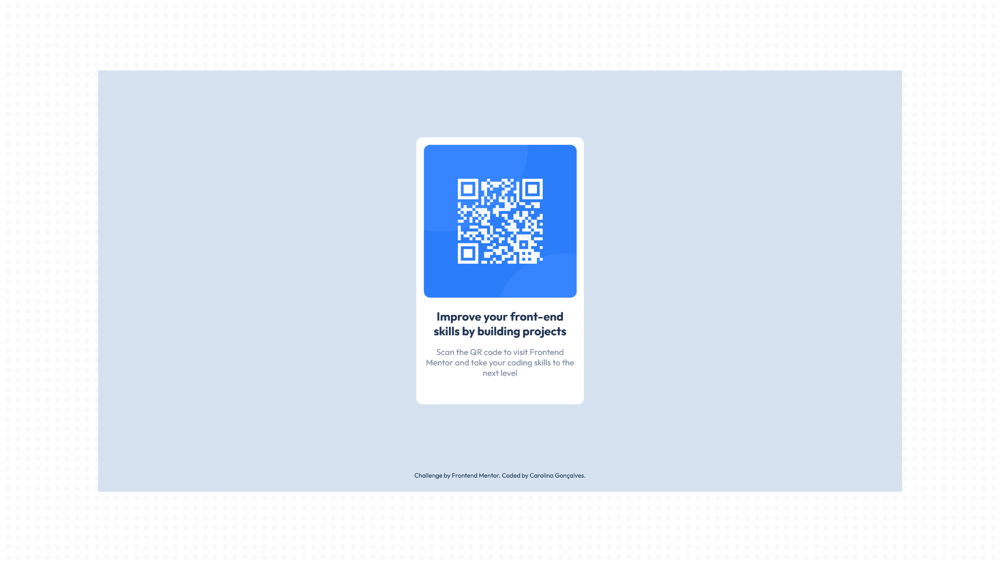
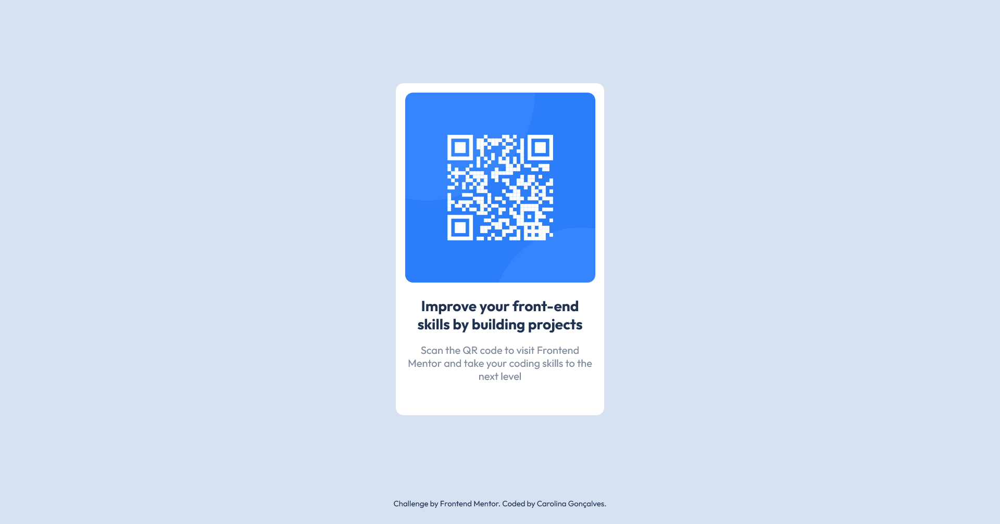

# Frontend Mentor - QR code component solution

This is a solution to the [QR code component challenge on Frontend Mentor](https://www.frontendmentor.io/challenges/qr-code-component-iux_sIO_H). Frontend Mentor challenges help you improve your coding skills by building realistic projects. 

## Table of contents

- [Overview](#overview)
  - [Screenshot](#screenshot)
  - [Links](#links)
- [My process](#my-process)
  - [Built with](#built-with)
  - [What I learned](#what-i-learned)
- [Author](#author)

## Overview
This documentation presents a detailed overview and explanation of the HTML and CSS files constituting the QR Code Component. The primary objective of this challenge was to create a responsive QR code component.

### Screenshot
| Desktop                                    | Mobile                                    | 
| ------------------------------------------ | ----------------------------------------- |
|   |   | 

### Links

- [Solution URL](https://github.com/uber-sleep/qr-code-component-main)
- [Live Site URL](https://uber-sleep.github.io/qr-code-component-main/)

## My process

### Built with

- Semantic HTML5 markup
- CSS custom properties
- Flexbox
- Responsive Web Design

### What I learned

During the creation of the QR Code Component for the Frontend Mentor challenge, I strengthened my knowledge of essential front-end concepts. Despite my familiarity with image responsiveness, media queries, CSS custom properties, and Flexbox, this challenge allowed me to fine-tune my responsive skills.

## Author

- [LinkedIn](https://www.linkedin.com/in/carolina-goncalves-/)
- [Github](https://github.com/uber-sleep)
- [Frontend Mentor](https://www.frontendmentor.io/profile/uber-sleep)
